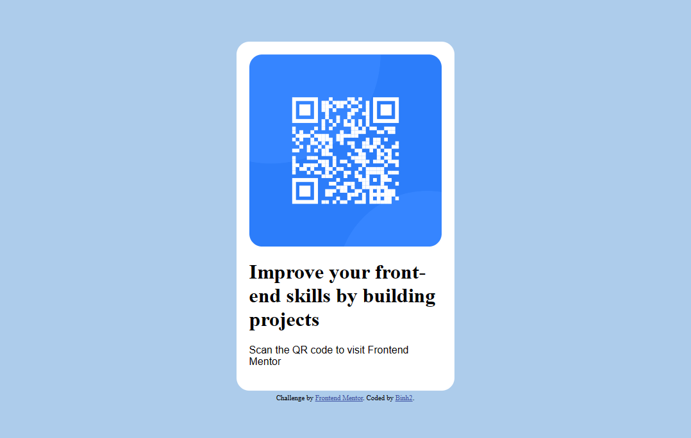

# Frontend Mentor - QR code component solution

This is a solution to the [QR code component challenge on Frontend Mentor](https://www.frontendmentor.io/challenges/qr-code-component-iux_sIO_H). Frontend Mentor challenges help you improve your coding skills by building realistic projects. 

## Table of contents

- [Overview](#Overview)
  - [Screenshot](#Screenshot)
  - [Links](#Links)
- [My process](#My-process)
  - [Built with](#Built-with)
  - [What I learned](#What-I-learned)
    -[from version 1](#from-version-1)
    -[from version 2](#from-version-2-\(current\))
  - [Useful resources](#Useful-resources)
- [Author](#Author)
- [My recent works](#My-recent-works)
- [Acknowledgments](#Acknowledgments)

## Overview

### Screenshot



### Links

- Solution URL: [Checkout my solution](https://github.com/Binh2/qr-code-component-v2)
- Live Site URL: [My live webpage](https://binh2.github.io/qr-code-component-v2/)

## My process

Although this is a small project but it is still very crucial to get down the workflow correctly

1. I started sketch the QR code component on figma (Even though I already know what the end result to look like, it is still a very important step to accomplish).
2. Next up, I add my text and images, CSS, *trying to center elements*, and so on,... 
3. Take in feedback from other developer and fix up my mistakes

### Built with

- Semantic HTML5 markup
- CSS custom properties

### What I learned

#### from version 1

```css
img { /* To center img tag */
	display: block;
	margin: 0 auto;
}
```

```css
.container { /* To center .container */
	position: absolute;
	top: 50%;
	left: 50%;
	transform: translateX(-50%) translateY(-50%);
}
```

#### from version 2 (current)

```html
<!-- Landmarks to help disabled people have an easier time on the web -->
<main></main>
<footer></footer>
```

For more info, checkout [Landmarks](https://dequeuniversity.com/rules/axe/4.3/landmark-one-main?application=axeAPI)

```css
.component { /* to center .component (sadly, I won't be using in this repo) */
	min-height: 100vh;
	display: flex;
	align-items: center;
	justify-content: center;
}
```

### Useful resources

- [Landmarks](https://dequeuniversity.com/rules/axe/4.3/landmark-one-main?application=axeAPI)

## Author

- Frontend Mentor - [@Binh2](https://www.frontendmentor.io/profile/Binh2)
- Twitter - [@hgqbinh2002](https://twitter.com/hgqbinh2002)
- LinkedIn - [hgqbinh2002](https://www.linkedin.com/in/hgqbinh2002/)

## My recent works

### QR code component (version 1)

- Solution URL: [Checkout my solution](https://github.com/Binh2/qr-code-component)
- Live Site URL: [My live webpage](https://binh2.github.io/qr-code-component/)

## Acknowledgments

Big thank to Frontend Mentor to give me the idea to do this project.
Big thank to [@Hassiai](https://www.frontendmentor.io/profile/Hassiai) from Frontend Mentor for giving feedback to my first QR code component project